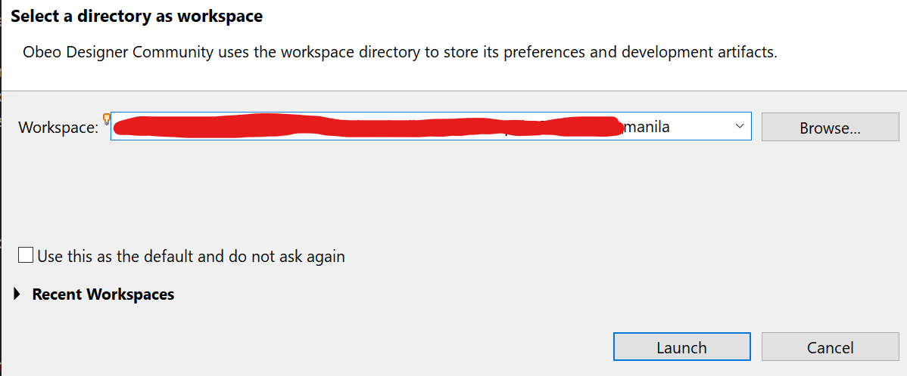
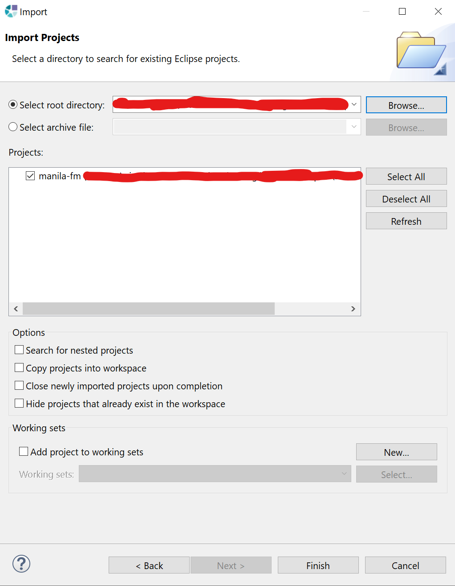
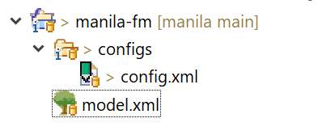
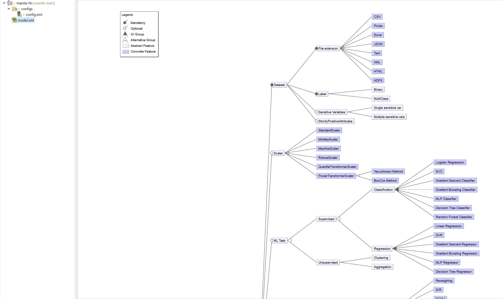
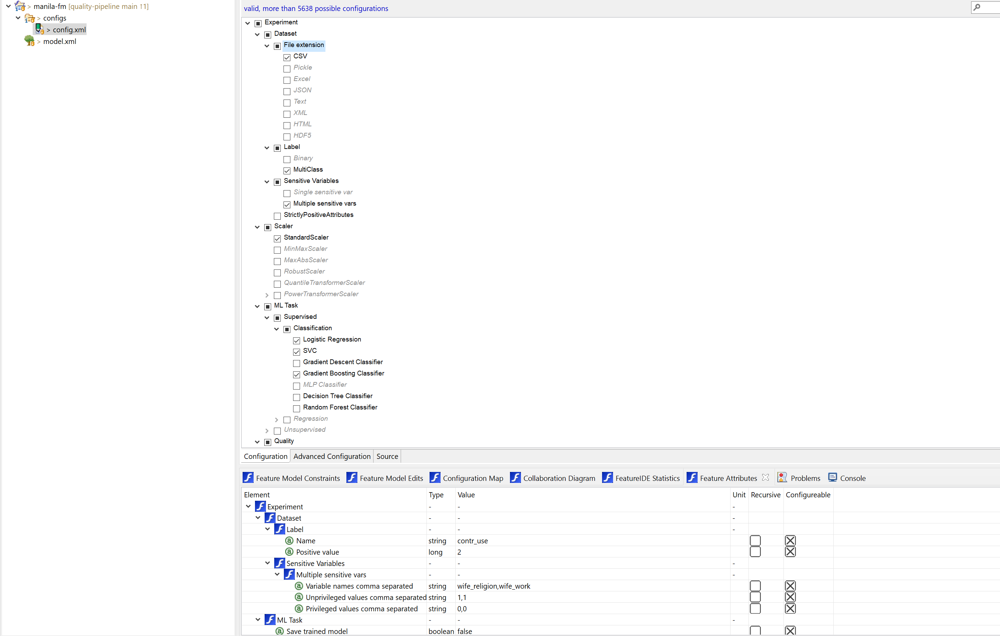

# MANILA Framework

[](https://www.gnu.org/licenses/agpl-3.0)

[](https://doi.org/10.5281/zenodo.8421769)

This repository cointains the source code of the _MANILA_ framework described in the papers _Democratizing Quality-Based Machine Learning Development through Extended Feature Models_ and _A Framework to Democratize the Quality-Based Machine Learning Development Through Extended Feature Models: Strengths and Limitations_.

## Citation Request

Please cite our work if you use it in your research:

_G. d’Aloisio, A. Di Marco, e G. Stilo, «Democratizing Quality-Based Machine Learning Development through Extended Feature Models», in Fundamental Approaches to Software Engineering, L. Lambers e S. Uchitel, A c. di, in Lecture Notes in Computer Science. Cham: Springer Nature Switzerland, 2023, pp. 88–110. doi: 10.1007/978-3-031-30826-0_5._

```bibtex
@inproceedings{daloisio_democratizing_2023,
	address = {Cham},
	series = {Lecture {Notes} in {Computer} {Science}},
	title = {Democratizing {Quality}-{Based} {Machine} {Learning} {Development} through {Extended} {Feature} {Models}},
	copyright = {All rights reserved},
	isbn = {978-3-031-30826-0},
	doi = {10.1007/978-3-031-30826-0_5},
	language = {en},
	booktitle = {Fundamental {Approaches} to {Software} {Engineering}},
	publisher = {Springer Nature Switzerland},
	author = {d’Aloisio, Giordano and Di Marco, Antinisca and Stilo, Giovanni},
	editor = {Lambers, Leen and Uchitel, Sebastián},
	year = {2023},
	pages = {88--110},
}
```

## Project Structure

This project is structured in the following way:

- **generator**: this folder contains all the files needed to generate an experiment workflow
  - **templates**: this folder contains all the Jinja templates used to generate the needed files
  - **generator.py**: main file to generate the experiment workflow
- **manila-fm**: this folder contains the implemented Extended Feature Model and the relative configuration specifications
  - **configs**: directory in which the configuration files are stored
  - **feature-model.png**: full picture of the Extended Feature Model
  - **model.xml**: specification of the Extended Feature Model
- **imgs**: this directory contains the images used in this README
- **replication_package**: this directory contains the replication package of the experiments conducted in section 5.2 of the paper. Refer to the [README](./replication_package/README.md) in the directory for more information.

## MANILA Setup

Please follow these steps to setup the MANILA framework:

### Environment setup

1. Install FeatureIDE following the instructions reported at the following [link](https://featureide.github.io/#download)
2. Install Miniconda following the instructions reported at the following [link](https://docs.conda.io/en/latest/miniconda.html#)
3. Create a new conda environment and install the Jinja package using these commands:

```shell
$ conda create -n manila_env python=3.9
$ conda activate manila_env
$ pip install Jinja2
```

### Importing the Extended Feature Model in FeatureIDE

1. Start Eclipse and select the root folder as workspace:



2. From the opened window click of _File_ -> _Import_ -> _Existing Project into Workspace_, select the root folder as the root directory and `manila-fm` should appear among the projects:



3. Click on Finish and the project should appear on the left panel:



4. Click on the `model.xml` file to open the Extended Feature Model:



5. Open the `config.xml` file to see an example configuration of an experiment:



<!-- 6. From the root folder call the generator file with the following command:

```shell
$ conda activate manila_env
$ python generator/generator.py -n manila-fm/configs/config.xml
```

7. Create the required environment and execute the generated experiment with the following commands:

```shell
$ conda env create -f gen/environment.yml
$ conda activate base_env
$ python gen/main.py -d test_data/cmc.csv
```

8. See the results in the `ris` folder -->

## License

This work is distributed under AGPL v3 License
